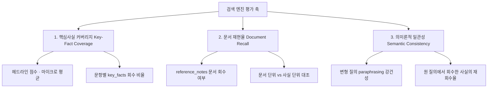

# 📊 Second Brain Search Engine Benchmark (SBSE-Bench)

세컨드 브레인 검색 엔진 벤치마크(SBSE-Bench)는 위키(Wiki)나 마크다운 폴더와 같은 비정형 지식 뭉치(세컨드 브레인)에서 정보와 맥락을 얼마나 정확하게 검색·추출하는지 평가하기 위한 오픈 소스 벤치마크 도구입니다.

이 벤치마크는 검색 레이어만 **결정론적으로** 측정합니다. LLM 답변 생성·채점이 없으므로 API 키나 비용이 필요 없고, 어떤 AI 에이전트 환경(Antigravity, Claude Code, Codex 등)에서 돌려도 **같은 엔진은 같은 숫자**가 나옵니다. 에이전트는 오직 엔진별 검색 어댑터(`search.py`)를 처음 한 번 작성할 때만 사용됩니다.

---

## 1. 에이전트별 설치 및 구동 방법 (Setup Guide)

사용자는 로컬에 소스코드를 클론할 필요 없이, 자신이 사용하는 에이전트 환경에서 **한 줄의 설치 명령**을 통해 벤치마크 스킬과 필요 데이터를 자동으로 통합 구성할 수 있습니다.

### 1) 통합 설치 (Common Remote Install)
어떠한 에이전트를 사용하든 터미널 프롬프트(또는 쉘)에 다음 명령을 실행하여 설치합니다.
```bash
curl -fsSL https://raw.githubusercontent.com/JeGwan/second-brain-search-benchmark/main/scripts/install.sh | bash
```
*이 스크립트는 로컬의 Python 3 환경을 체크하고, 벤치마크 코어(평가기·질문지·데이터셋·스킬·어댑터 규약)를 다운로드하며, 현재 활성화된 에이전트 환경(Gemini, Claude, Codex)을 감지하여 적절한 폴더에 스킬(`SKILL.md`)을 자동 설치/등록합니다.*

> 평가기는 결정론적 검색 측정만 수행하므로 API 키·LLM 호출이 필요 없습니다.

### 2) 엔진 어댑터 (Bring Your Own Engine)
SBSE-Bench는 **엔진-agnostic** 합니다. 평가는 `engines/<엔진이름>/search.py` 라는
**고정된 검색 호출**을 통해 이루어집니다(이 고정이 결정론적 측정의 전제). 단,
사용자가 이 파일을 손으로 짤 필요는 없습니다.

* **자동(권장)**: `/sbse-bench <엔진이름>` 을 호출하면 에이전트가 **0단계 어댑터
  부트스트랩**을 수행합니다 — 엔진의 `--help`/문서/MCP 스펙을 조사해 규약에 맞는
  `search.py` 를 1회 생성하고, 이후에는 그 파일을 고정 재사용합니다.
* **수동**: 직접 작성하려면 규약을 따르세요. 위치 `engines/<엔진이름>/search.py`,
  계약 = 질의를 `argv[1]` 로 받아 검색 컨텍스트를 **stdout** 출력(원본 문서명 포함 시
  검색 재현율 측정에 유리). 자세한 규약·예시: [`engines/README.md`](engines/README.md).

어느 경우든, 평가할 엔진에 `second_brain/` 을 색인합니다(엔진마다 방식이 다름).

---

### 3) 구동 방법 (Running the Benchmark)
가장 쉬운 방법은 에이전트에게 `/sbse-bench <engine>` (또는 "sbse-bench 스킬로 `<engine>`
벤치마크 수행해줘")이라고 요청하는 것입니다. 그러면 에이전트가 `SKILL.md` 가이드에 따라
어댑터가 없으면 0단계 부트스트랩으로 `search.py` 를 만든 뒤, 아래 단일 명령을 실행합니다.

```bash
# 검색 실행(원 질의 + 변형 질의) → 3지표 계산 → engines/<engine>/report.md + report.results.json
python3 evaluator.py run --engine <engine>
```

단일 명령으로 끝납니다. 별도 단계·작업 파일·반복 실행이 없으며, 검색이 결정론적이라
어떤 환경에서 돌려도 동일한 보고서가 나옵니다.

> LLM 없이 캐시에서 보고서만 다시 만들려면:
> `python3 evaluator.py render engines/<engine>/report.results.json`

---

## 2. 용어 정의 (Terminology)

역할과 대상에 대해 합의된 명확한 개념 정의는 다음과 같습니다.

1.  **세컨드 브레인 (Second Brain)**: 팀이나 개인이 지식을 저장하는 위키(Wiki), 마크다운(Markdown) 폴더와 같은 비정형 지식 뭉치. (벤치마크의 **입력 데이터**)
2.  **세컨드 브레인 검색 엔진 (Second Brain Search Engine)**: 세컨드 브레인에서 에이전트나 사람이 지식을 정확하고 효율적으로 추출할 수 있도록 돕는 엔진. (벤치마크의 **평가 대상**)
3.  **세컨드 브레인 검색 엔진 벤치마크 (Second Brain Search Engine Benchmark)**: 검색 엔진이 세컨드 브레인의 정보를 얼마나 왜곡 없이, 누락 없이, 잘 추론하여 제공하는지 검증하는 도구. (우리가 **개발하는 산출물**)

---

## 3. 평가 축 설계 (Evaluation Axes)

검색 레이어의 품질은 "정답을 담은 문서/텍스트를 회수했는가"로 정의되며, 이는 전적으로
결정론적으로 측정 가능합니다. SBSE-Bench는 **3개의 결정론적 지표**로 평가합니다.



### 1) 핵심사실 커버리지 (Key-Fact Coverage) — 헤드라인
*   문항별 `key_facts`(금액, 승인번호, 인명, 계좌번호 등 이산적 사실) 중, 정규화 후
    알리아스가 검색 컨텍스트에 등장한 사실의 비율. 모든 문항의 사실을 한 풀로 모아
    계산하는 **마이크로 평균**이 주 점수입니다. 청크 커버리지 문제를 직접 포착합니다.

### 2) 문서 재현율 (Document Recall)
*   정답 근거 문서(`reference_notes`)가 검색 컨텍스트에 회수됐는지의 비율. 핵심사실
    커버리지와 대조하면 점수 손실의 책임이 **문서 단위 검색 실패**인지 **청크 커버리지
    실패**인지 분리됩니다. (재현율 100% 인데 커버리지가 낮으면 청크 문제.)

### 3) 의미론적 일관성 (Semantic Consistency)
*   질문의 표현이 달라져도(`paraphrased_questions`) 같은 핵심 사실을 회수하는지의 정도.
    원 질의에서 회수된 사실이 변형 질의에서도 회수되는 비율로 측정하며, LLM이 개입하지
    않으므로 완전히 결정론적입니다.

> 멀티홉 문항은 "추론 서술"이 아니라 여러 `reference_notes`에 흩어진 핵심 사실 조각을
> 검색이 모두 회수했는가(멀티홉 커버리지)로 환원합니다.

---

## 4. 결정론적 측정 원리 (How it Works)

평가기(`evaluator.py`)는 검색을 실행하고 위 3지표를 **문자열 매칭으로 직접** 계산합니다.
LLM 답변 생성·채점이 없으므로 측정 대상이 검색 레이어로 한정되고, 어떤 모델·에이전트
환경에서 돌려도 **같은 엔진은 같은 숫자**가 나옵니다.

1.  **검색 실행 (Search)**:
    *   `run` 이 `engines/<engine>/search.py` 를 호출해 원 질의와 변형 질의에 대한 검색
        컨텍스트(stdout)를 수집합니다.
2.  **결정론적 매칭 (Deterministic Matching)**:
    *   각 `key_fact` 는 알리아스 중 하나라도 정규화(NFKC·소문자·공백·천단위 콤마 제거)
        후 컨텍스트에 부분문자열로 등장하면 "회수됨"으로 간주합니다. LLM 추론·격리
        서브에이전트·작업 파일 핸드오프가 전혀 없습니다.
3.  **검색/청크 분리 (Search vs Chunk Diagnosis)**:
    *   `reference_notes` 대비 문서 재현율을 별도 계산하여, 점수 하락의 책임이 *문서를
        못 찾은 것*인지 *문서는 찾았으나 청크가 정답 줄을 놓친 것*인지 분리합니다.
4.  **재현성 (Reproducibility)**:
    *   결과는 `report.results.json` 캐시로 저장되며 `evaluator.py render` 로 보고서를
        재생성할 수 있습니다. 검색이 결정론적이라 반복 실행해도 항상 동일합니다.

---

## 5. 공식 벤치마크 리더보드 (Leaderboard)

헤드라인은 **핵심사실 커버리지(마이크로 평균)** 입니다. 측정이 결정론적이고 모델 교란이
없으므로, **engine 단독 비교가 정당**합니다 — 같은 엔진은 어떤 에이전트 환경에서 돌려도
동일한 숫자가 나옵니다. (표본이 작으므로(문항 5개) 단일 순위보다 지표 3개를 함께 읽으세요.)

| 순위 | 검색 엔진 (Engine) | 핵심사실 커버리지 | 문서 재현율 | 의미론적 일관성 | 평가 일자 | 보고서 |
| :---: | :--- | :---: | :---: | :---: | :---: | :---: |
| 🥇 | **QMD** (QMD_TOP_N=5) | **75.0%** | 100% | 86.7% | 2026-06-20 | [보기](engines/qmd/report.md) |
| - | *다음 엔진 기여를 기다립니다!* | - | - | - | - | - |

> **평가 조건**: 결정론적 검색 측정 — LLM 답변 모델·채점이 개입하지 않고, 안정성 다회
> 실행 평균도 사용하지 않습니다. 핵심사실 커버리지는 문항별 핵심 사실(key_facts)이 검색
> 컨텍스트에 직접 등장했는지를 매칭한 마이크로 평균(9/12)이며, 어떤 에이전트 환경에서
> 돌려도 동일한 숫자가 재현됩니다.

### QMD 주요 분석 피드백 (결정론적 측정)
*   **강점**: 단일·다중문서 핵심사실 회수가 강함 — `Q-01`(사실 정합성)·`Q-04`(논리적 멀티홉)·`Q-05`(의미 매칭)에서 핵심사실 커버리지가 높습니다.
*   **보완점**: `Q-02`(인물 직책)·`Q-03`(휴직 날짜)에서 **문서 재현율은 100%**(필요 문서 모두 회수)인데도 핵심사실 커버리지가 낮은 이유는, QMD가 반환한 **스니펫(청크) 경계** 안에 정답을 담은 특정 줄(김마리의 '개발1팀 비서' 직책 라인, 강민우의 '6/15 휴직' 라인)이 포함되지 않았기 때문입니다. 즉 **문서 단위 검색은 성공했으나 청크 단위 커버리지가 부족**한 문제로, 청크 크기/오버랩 조정으로 개선 가능합니다. 두 지표(문서 재현율 vs 핵심사실 커버리지)의 차이가 이 진단을 결정론적으로 드러냅니다.

---

## 6. 리포지토리 폴더 구조 (Directory Structure)

설치 스크립트가 배포하는 **코어**(엔진-agnostic)와, 리포지토리에만 있는 **예제 엔진**을 구분합니다.

```
second-brain-search-benchmark/
├── README.md               # 벤치마크 개요, 설치 및 실행 안내
├── evaluator.py            # 결정론적 검색 측정기 (검색 실행, 3지표 계산, 보고서)
├── questions.json          # 표준 평가 질문지 (5문항, key_facts·알리아스·변형질문 포함)
├── second_brain/           # 표준 테스트 데이터셋 (비정형 마크다운 폴더)
│   ├── 01_횡령의혹_내부감사보고서.md
│   ├── 02_재무팀_비밀_장부.md
│   ├── 03_인사기록_및_조직도.md
│   └── 04_사내_메신저_백업.md
├── scripts/
│   └── install.sh          # 에이전트 환경 자동 감지 및 코어 설치 스크립트
├── skills/
│   └── sbse-bench/
│       └── SKILL.md        # 에이전트 스킬 설정 파일
└── engines/                # 평가 대상별 폴더 = 어댑터 + 그 실행 산출물(자기완결)
    ├── README.md           # ★ 엔진 어댑터 규약(contract)
    ├── qmd/                # (예제, 설치본 미포함) QMD 어댑터 — 리더보드 재현용
    │   ├── README.md
    │   ├── search.py       #   질의→stdout 검색 어댑터 (입력/고정)
    │   ├── report.md       #   결과 보고서 (3지표)
    │   └── report.results.json  # 측정 결과 캐시 (영속 기록·render 재현용)
    └── no-engine/          # (예제) 검색엔진 없이 전체 폴더를 그대로 주는 어댑터 — 데이터셋 자기검증
        ├── README.md       #   = 질문지/알리아스 셀프테스트 (전체 문서 → 커버리지 100% 기대)
        └── search.py
```

> 한 평가 대상의 **모든 것(어댑터·보고서·결과 캐시)이 `engines/<engine>/` 한 폴더**에
> 모입니다(자기완결). 별도 `results/` 폴더는 없습니다.
> 엔진 어댑터(`engines/<engine>/search.py`)는 에이전트가 0단계에서 자동 생성하거나
> 사용자가 직접 작성합니다. 설치 스크립트는
> 어댑터를 배포하지 않으며, `engines/qmd`·`engines/no-engine` 는 작성 예시일 뿐입니다.
