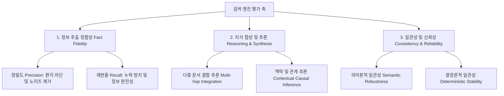

# 📊 Second Brain Search Engine Benchmark (SBSE-Bench)

세컨드 브레인 검색 엔진 벤치마크(SBSE-Bench)는 위키(Wiki)나 마크다운 폴더와 같은 비정형 지식 뭉치(세컨드 브레인)에서 정보와 맥락을 얼마나 정확하게 검색·추출하는지 평가하기 위한 오픈 소스 벤치마크 도구입니다.

이 리포지토리는 API 키 발급 및 비용 지불 없이, 사용자가 월 구독형으로 사용하는 다양한 AI 에이전트(Antigravity, Claude Code, Codex 등)의 실행 권한을 활용하여 안전하게 격리된 무맥락 벤치마크를 수행할 수 있도록 설계되어 있습니다.

---

## 1. 에이전트별 설치 및 구동 방법 (Setup Guide)

사용자는 로컬에 소스코드를 클론할 필요 없이, 자신이 사용하는 에이전트 환경에서 **한 줄의 설치 명령**을 통해 벤치마크 스킬과 필요 데이터를 자동으로 통합 구성할 수 있습니다.

### 1) 통합 설치 (Common Remote Install)
어떠한 에이전트를 사용하든 터미널 프롬프트(또는 쉘)에 다음 명령을 실행하여 설치합니다.
```bash
curl -fsSL https://raw.githubusercontent.com/JeGwan/second-brain-search-benchmark/main/scripts/install.sh | bash
```
*이 스크립트는 로컬의 Python 3 환경을 체크하고, 벤치마크 코어(평가기·질문지·데이터셋·스킬·어댑터 규약)를 다운로드하며, 현재 활성화된 에이전트 환경(Gemini, Claude, Codex)을 감지하여 적절한 폴더에 스킬(`SKILL.md`)을 자동 설치/등록합니다.*

### 2) 엔진 어댑터 (Bring Your Own Engine)
SBSE-Bench는 **엔진-agnostic** 합니다. 평가는 `engines/<엔진이름>/search.py` 라는
**고정된 검색 호출**을 통해 이루어집니다(이 고정이 결정론적 일관성·검색 재현율 측정의
전제). 단, 사용자가 이 파일을 손으로 짤 필요는 없습니다.

* **자동(권장)**: `/sbse-bench <엔진이름>` 을 호출하면 에이전트가 **0단계 어댑터
  부트스트랩**을 수행합니다 — 엔진의 `--help`/문서/MCP 스펙을 조사해 규약에 맞는
  `search.py` 를 1회 생성하고, 이후에는 그 파일을 고정 재사용합니다.
* **수동**: 직접 작성하려면 규약을 따르세요. 위치 `engines/<엔진이름>/search.py`,
  계약 = 질의를 `argv[1]` 로 받아 검색 컨텍스트를 **stdout** 출력(원본 문서명 포함 시
  검색 재현율 측정에 유리). 자세한 규약·예시: [`engines/README.md`](engines/README.md).

어느 경우든, 평가할 엔진에 `second_brain/` 을 색인합니다(엔진마다 방식이 다름).

---

### 3) 구동 방법 (Running the Benchmark)
가장 쉬운 방법은 에이전트에게 `/sbse-bench <engine>` (또는 "sbse-bench 스킬로 `<engine>`
벤치마크 수행해줘")이라고 요청하는 것입니다. 그러면 에이전트가 `SKILL.md` 가이드에 따라
아래 5단계 파이프라인을 대신 수행합니다. 평가기는 결정론적인 일만 하고, **답변/채점은
에이전트가 격리 서브에이전트를 띄워** 처리합니다. (Antigravity·Claude Code·Codex 공통)

```bash
# 1) 검색 실행 + 프롬프트 생성 → engines/<engine>/run.json
python3 evaluator.py prepare --engine <engine> --stability-runs 2 --answer-source "<답변 모델명>"

# 2) (에이전트) run.json 의 각 항목 answer_prompt 로 격리 답변 서브에이전트를 띄워 answer 채움

# 3) 답변을 받아 컨텍스트 포함 채점 프롬프트 생성
python3 evaluator.py grade-prompts --engine <engine>

# 4) (에이전트) 각 항목 grade_prompt 로 격리 채점 서브에이전트를 띄워 score/reason 채움

# 5) 집계 → engines/<engine>/report.md + report.results.json
python3 evaluator.py assemble --engine <engine>
```

> 이전의 stdin 중계·마커(`=== SUBAGENT_PROMPT ===`) 기반 대화형 프로토콜은 **폐기**되었습니다.
> 이제 평가기와 에이전트는 단일 작업 파일 `run.json` 으로 핸드오프합니다.
>
> LLM 없이 채점 결과로 보고서만 다시 만들려면:
> `python3 evaluator.py render engines/<engine>/report.results.json`

---

## 2. 용어 정의 (Terminology)

역할과 대상에 대해 합의된 명확한 개념 정의는 다음과 같습니다.

1.  **세컨드 브레인 (Second Brain)**: 팀이나 개인이 지식을 저장하는 위키(Wiki), 마크다운(Markdown) 폴더와 같은 비정형 지식 뭉치. (벤치마크의 **입력 데이터**)
2.  **세컨드 브레인 검색 엔진 (Second Brain Search Engine)**: 세컨드 브레인에서 에이전트나 사람이 지식을 정확하고 효율적으로 추출할 수 있도록 돕는 엔진. (벤치마크의 **평가 대상**)
3.  **세컨드 브레인 검색 엔진 벤치마크 (Second Brain Search Engine Benchmark)**: 검색 엔진이 세컨드 브레인의 정보를 얼마나 왜곡 없이, 누락 없이, 잘 추론하여 제공하는지 검증하는 도구. (우리가 **개발하는 산출물**)

---

## 3. 평가 축 설계 (Evaluation Axes)

세컨드 브레인 검색 엔진이 갖추어야 할 핵심 성능을 측정하기 위해 **3대 영역, 6개 세부 지표**로 평가 축을 정의합니다.



### 1) 정보 추출 정합성 (Fact Fidelity)
*   **정밀도 (Precision - 환각 차단)**: 세컨드 브레인에 없는 거짓 내용(환각)을 지어내거나 과도하게 왜곡하여 답변하는지 검증.
*   **재현율 (Recall - 누락 방지)**: 질문에 답하기 위해 필수적인 핵심 사실(Key Facts)을 누락하지 않고 온전히 찾아내어 답변하는지 검증.

### 2) 지식 합성 및 추론 (Reasoning & Synthesis)
*   **다중 문서 결합 추론 (Multi-hop Integration)**: 하나의 문서가 아니라 여러 개별 메모에 흩어진 정보들을 종합하여 연관 관계나 논리를 연결하는 능력 검증.
*   **맥락 및 관계 추론 (Contextual Causal Inference)**: 텍스트에 명시적으로 나타나지 않더라도 전체적인 타임라인, 인물의 동기, 사건의 선후관계를 바탕으로 논리적으로 인과관계를 추론하는 능력 검증.

### 3) 일관성 및 신뢰성 (Consistency & Reliability)
*   **의미론적 일관성 (Semantic Robustness)**: 질문의 형태나 표현(Paraphrasing)이 달라지더라도 일관되게 정확한 핵심 지식을 찾아내어 답변하는지 검증.
*   **결정론적 일관성 (Deterministic Stability)**: 동일한 질문을 여러 번 입력했을 때, 지식 추출의 완성도나 결과가 균일하게 유지되는지 검증.

---

## 4. 에이전트 격리 실행 원리 (How it Works)

평가기(`evaluator.py`)는 **결정론적인 일만** 합니다(검색 실행·프롬프트 생성·재현율 계산·집계).
**답변/채점처럼 에이전트가 필요한 일은 오케스트레이터 에이전트가 격리 서브에이전트를 띄워**
수행하고, 둘은 단일 작업 파일 `engines/<engine>/run.json` 으로 주고받습니다. (stdin 중계·마커 없음)

1.  **무맥락/격리 (No Context & Isolation)**:
    *   `prepare` 가 `search.py`를 실행해 컨텍스트를 추출하고 항목별 답변 프롬프트를 만듭니다.
    *   에이전트는 **항목마다 독립된 서브에이전트**를 띄워 그 항목의 `answer_prompt`(질문+컨텍스트)만 줍니다.
    *   서브에이전트는 이 작업이 벤치마크인지, 원본 파일 위치도 모른 채 주어진 컨텍스트만으로 답합니다 (치팅·추가 조회 차단). 답변은 `run.json` 에 채워집니다.
2.  **무비용 채점 (Zero-Cost Grading)**:
    *   `grade-prompts` 가 채점 프롬프트를 만들고, 에이전트가 격리 채점 서브에이전트로 1~3점 + 사유(JSON)를 받아 `run.json` 에 채웁니다. `assemble` 이 집계·렌더링합니다.
    *   API 키가 전혀 필요 없으며, 에이전트의 월 구독 크레딧으로 전체 연산이 완결됩니다.
3.  **컨텍스트 기반 채점 + 검색/생성 분리 (Context-grounded Grading)**:
    *   채점기는 **검색된 컨텍스트를 함께 받아**, 환각(hallucination) 여부를 정답이 아니라 *제시된 컨텍스트* 기준으로 판정합니다. (컨텍스트에 없어서 "답변 불가"라고 정직하게 밝힌 것은 감점하지 않습니다.)
    *   `reference_notes` 대비 **검색 재현율(Retrieval Recall)** 을 별도로 계산하여, 점수 하락의 책임이 *검색*인지 *생성/추론*인지 분리합니다.
4.  **재현성 (Reproducibility)**:
    *   헤드라인 점수는 반복 실행(stability-runs)의 **평균**이며, 채점 결과는 `report.results.json` 캐시로 저장되어 `evaluator.py render` 로 LLM 없이 보고서를 재생성할 수 있습니다.

---

## 5. 공식 벤치마크 리더보드 (Leaderboard)

헤드라인 점수는 stability-runs **평균**입니다. 표본이 작으므로(문항 5개) 소수점 차이는
노이즈이며, 단일 순위보다 영역별 강약점·검색 재현율과 함께 해석해야 합니다.

| 순위 | 검색 엔진 (Engine) | 전체 점수 (평균) | 달성도 (%) | 검색 재현율 | 안정성(StdDev) | 평가 일자 | 보고서 |
| :---: | :--- | :---: | :---: | :---: | :---: | :---: | :---: |
| 🥇 | **QMD** (QMD_TOP_N=5) | **13.0 / 15** | **86.7%** | 100% | 0.000 | 2026-06-20 | [보기](engines/qmd/report.md) |
| - | *다음 엔진 기여를 기다립니다!* | - | - | - | - | - | - |

> 평가 조건: 컨텍스트 기반 채점기, 2회 실행 평균, 답변 모델 Claude Opus 4.8.
> (이번 패스는 5개 원본 문항만 측정 — 변형질문 기반 의미론적 축은 미측정.)

### QMD 주요 분석 피드백 (컨텍스트 기반 채점)
*   **강점**: 단일·다중문서 사실 검색이 강함 — `Q-01`(사실 정합성)·`Q-04`(논리적 멀티홉)·`Q-05`(의미 매칭) 모두 **3.0/3 만점**. 반복 실행 간 점수 변동이 전혀 없어(**std 0.000**) 결정론적 안정성도 우수.
*   **보완점**: `Q-02`(인물 직책)·`Q-03`(휴직 날짜)이 2.0/3. **검색 재현율은 100%**(필요 문서 모두 회수)인데도 점수가 깎인 이유는, QMD가 반환한 **스니펫(청크) 경계** 안에 정답을 담은 특정 줄(김마리의 '개발1팀 비서' 직책 라인, 강민우의 '6/15 휴직' 라인)이 포함되지 않았기 때문입니다. 즉 **문서 단위 검색은 성공했으나 청크 단위 커버리지가 부족**한 문제로, 청크 크기/오버랩 조정으로 개선 가능합니다.
*   **컨텍스트 기반 채점 도입 전 대비**: 10.5 → 13.0. 채점기가 컨텍스트를 보게 되면서 Q-01·Q-04의 잘못된 환각 감점이 해소됨(각 +1.5, +1.5는 평균 기준). 검색 재현율 지표로 Q-02·Q-03의 책임이 '생성'이 아니라 '검색 청크 커버리지'임을 분리해 확인.

---

## 6. 리포지토리 폴더 구조 (Directory Structure)

설치 스크립트가 배포하는 **코어**(엔진-agnostic)와, 리포지토리에만 있는 **예제 엔진**을 구분합니다.

```
second-brain-search-benchmark/
├── README.md               # 벤치마크 개요, 설치 및 실행 안내
├── evaluator.py            # 공통 평가 채점 엔진 (격리 답변/채점 중계, 검색 재현율, 보고서)
├── questions.json          # 표준 평가 질문지 + 채점 루브릭 (5문항, 변형질문 포함)
├── second_brain/           # 표준 테스트 데이터셋 (비정형 마크다운 폴더)
│   ├── 01_횡령의혹_내부감사보고서.md
│   ├── 02_재무팀_비밀_장부.md
│   ├── 03_인사기록_및_조직도.md
│   └── 04_사내_메신저_백업.md
├── scripts/
│   └── install.sh          # 에이전트 환경 자동 감지 및 코어 설치 스크립트
├── skills/
│   └── sbse-bench/
│       └── SKILL.md        # 에이전트 스킬 설정 파일
└── engines/                # 평가 대상별 폴더 = 어댑터 + 그 실행 산출물(자기완결)
    ├── README.md           # ★ 엔진 어댑터 규약(contract)
    ├── qmd/                # (예제, 설치본 미포함) QMD 어댑터 — 리더보드 재현용
    │   ├── README.md
    │   ├── search.py       #   질의→stdout 검색 어댑터 (입력/고정)
    │   ├── run.json        #   작업 파일 (런 중 생성·gitignore: prepare→답변→grade-prompts→채점→assemble 핸드오프)
    │   ├── report.md       #   결과 보고서
    │   └── report.results.json  # 채점 결과 캐시 (영속 기록·render 재현용)
    └── no-engine/          # (예제) 검색엔진 없이 전체 폴더를 그대로 주는 어댑터 템플릿
        ├── README.md       #   = '무검색' 베이스라인. 점수는 답변 agent-model에 종속 → 모델별 폴더로 복사
        └── search.py
```

> 한 평가 대상의 **모든 것(어댑터·답변/컨텍스트 캐시·보고서·채점 캐시)이
> `engines/<engine>/` 한 폴더**에 모입니다(자기완결). 별도 `results/` 폴더는 없습니다.
> 엔진 어댑터(`engines/<engine>/search.py`)는 에이전트가 0단계에서 자동 생성하거나
> 사용자가 직접 작성합니다. 설치 스크립트는
> 어댑터를 배포하지 않으며, `engines/qmd`·`engines/no-engine` 는 작성 예시일 뿐입니다.
