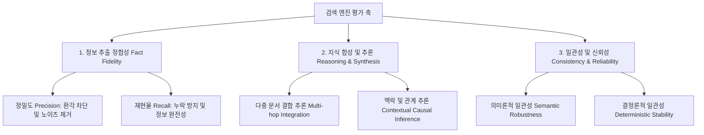

# 📊 Second Brain Search Engine Benchmark (SBSE-Bench)

세컨드 브레인 검색 엔진 벤치마크(SBSE-Bench)는 위키(Wiki)나 마크다운 폴더와 같은 비정형 지식 뭉치(세컨드 브레인)에서 정보와 맥락을 얼마나 정확하게 검색·추출하는지 평가하기 위한 오픈 소스 벤치마크 도구입니다.

이 리포지토리는 API 키 발급 및 비용 지불 없이, 사용자가 월 구독형으로 사용하는 다양한 AI 에이전트(Antigravity, Claude Code, Codex 등)의 실행 권한을 활용하여 안전하게 격리된 무맥락 벤치마크를 수행할 수 있도록 설계되어 있습니다.

---

## 1. 에이전트별 설치 및 구동 방법 (Setup Guide)

사용자는 로컬에 소스코드를 클론할 필요 없이, 자신이 사용하는 에이전트 환경에서 **한 줄의 설치 명령**을 통해 벤치마크 스킬과 필요 데이터를 자동으로 통합 구성할 수 있습니다.

### 1) 통합 설치 (Common Remote Install)
어떠한 에이전트를 사용하든 터미널 프롬프트(또는 쉘)에 다음 명령을 실행하여 설치합니다.
```bash
curl -fsSL https://raw.githubusercontent.com/JeGwan/second-brain-search-benchmark/main/scripts/install.sh | bash
```
*이 스크립트는 로컬의 Python 3 환경을 체크하고, 벤치마크에 필요한 데이터셋을 다운로드하며, 현재 활성화된 에이전트 환경(Gemini, Claude, Codex)을 감지하여 적절한 폴더에 스킬(`SKILL.md`)을 자동 설치/등록합니다.*

---

### 2) 에이전트별 구동 방법 (Running the Benchmark)

#### 🔹 Antigravity (Gemini-based Agent)
Antigravity CLI는 파일 구조 기반의 커스텀 **스킬(Skills)** 시스템을 기본 지원합니다.
*   **스킬 호출**: 채팅창에 아래와 같이 입력하여 실행합니다.
    ```
    /sbse-bench qmd
    ```
    *또는 "sbse-bench 스킬로 qmd 벤치마크 수행해줘"라고 한글로 자유롭게 입력해도 동작합니다.*

#### 🔹 Claude Code (Anthropic CLI Agent)
Claude Code는 터미널 실행에 특화되어 있으며, 쉘 명령어와의 연동이 매우 강력합니다.
*   **구동 방법**: Claude Code 프롬프트에 직접 아래 가이드와 명령어를 입력합니다.
    > "아래 명령어로 평가기를 구동하고, `=== SUBAGENT_PROMPT_START ===` 마커와 함께 질문이 제공되면 다른 문서를 직접 열지 말고(격리), 질문에 포함된 컨텍스트 정보만 참고하여 답변해줘."
    
    ```bash
    python3 evaluator.py --engine qmd --interactive-agent
    ```

#### 🔹 Codex (OpenAI Developer Agent Framework)
Codex 및 기타 개발자용 커스텀 에이전트 프레임워크 환경입니다.
*   **구동 방법**: Codex가 횡령 문서를 직접 읽는 치팅을 쓰지 않도록 실행 프롬프트를 지정하여 구동합니다.
    > "아래 명령어를 실행하고, `=== SUBAGENT_PROMPT` 마커가 감지되면 출력된 텍스트 범위 내에서만 100% 무맥락 격리 상태로 답변을 순차적으로 작성해서 stdin으로 입력해줘."
    
    ```bash
    python3 evaluator.py --engine qmd --interactive-agent
    ```

---

## 2. 용어 정의 (Terminology)

역할과 대상에 대해 합의된 명확한 개념 정의는 다음과 같습니다.

1.  **세컨드 브레인 (Second Brain)**: 팀이나 개인이 지식을 저장하는 위키(Wiki), 마크다운(Markdown) 폴더와 같은 비정형 지식 뭉치. (벤치마크의 **입력 데이터**)
2.  **세컨드 브레인 검색 엔진 (Second Brain Search Engine)**: 세컨드 브레인에서 에이전트나 사람이 지식을 정확하고 효율적으로 추출할 수 있도록 돕는 엔진. (벤치마크의 **평가 대상**)
3.  **세컨드 브레인 검색 엔진 벤치마크 (Second Brain Search Engine Benchmark)**: 검색 엔진이 세컨드 브레인의 정보를 얼마나 왜곡 없이, 누락 없이, 잘 추론하여 제공하는지 검증하는 도구. (우리가 **개발하는 산출물**)

---

## 3. 평가 축 설계 (Evaluation Axes)

세컨드 브레인 검색 엔진이 갖추어야 할 핵심 성능을 측정하기 위해 **3대 영역, 6개 세부 지표**로 평가 축을 정의합니다.



### 1) 정보 추출 정합성 (Fact Fidelity)
*   **정밀도 (Precision - 환각 차단)**: 세컨드 브레인에 없는 거짓 내용(환각)을 지어내거나 과도하게 왜곡하여 답변하는지 검증.
*   **재현율 (Recall - 누락 방지)**: 질문에 답하기 위해 필수적인 핵심 사실(Key Facts)을 누락하지 않고 온전히 찾아내어 답변하는지 검증.

### 2) 지식 합성 및 추론 (Reasoning & Synthesis)
*   **다중 문서 결합 추론 (Multi-hop Integration)**: 하나의 문서가 아니라 여러 개별 메모에 흩어진 정보들을 종합하여 연관 관계나 논리를 연결하는 능력 검증.
*   **맥락 및 관계 추론 (Contextual Causal Inference)**: 텍스트에 명시적으로 나타나지 않더라도 전체적인 타임라인, 인물의 동기, 사건의 선후관계를 바탕으로 논리적으로 인과관계를 추론하는 능력 검증.

### 3) 일관성 및 신뢰성 (Consistency & Reliability)
*   **의미론적 일관성 (Semantic Robustness)**: 질문의 형태나 표현(Paraphrasing)이 달라지더라도 일관되게 정확한 핵심 지식을 찾아내어 답변하는지 검증.
*   **결정론적 일관성 (Deterministic Stability)**: 동일한 질문을 여러 번 입력했을 때, 지식 추출의 완성도나 결과가 균일하게 유지되는지 검증.

---

## 4. 에이전트 격리 실행 원리 (How it Works)

에이전트는 벤치마크 실행 시 아래와 같이 철저히 통제된 샌드박스 루프를 돌며 답변과 채점을 수행합니다.

1.  **무맥락/격리 (No Context & Isolation)**:
    *   평가기(`evaluator.py`)가 검색 엔진의 `search.py`를 실행하여 검색 결과만 추출합니다.
    *   에이전트는 질문과 검색된 텍스트조각(Context) 정보만 담아 **독립된 `self` 서브에이전트**를 띄웁니다.
    *   서브에이전트는 이 대화가 벤치마크의 일부라는 정보나 전체 원본 마크다운 파일들의 위치를 모른 채 오로지 주어진 텍스트 내용에 기반해서만 답변을 작성하여 제출합니다 (LLM의 치팅 및 정보 추가 획득 원천 차단).
2.  **무비용 채점 (Zero-Cost Grading)**:
    *   답변 생성이 완료되면, 다시 독립된 서브에이전트를 띄워 채점 루브릭에 따라 답변을 1~3점으로 매기고 그 이유를 JSON 포맷으로 평가기에 전달합니다.
    *   사용자는 어떠한 API 키도 발급받을 필요가 없으며, 에이전트의 월 구독 크레딧으로 벤치마크 전체 연산이 완결됩니다.

---

## 5. 공식 벤치마크 리더보드 (Leaderboard)

| 순위 | 검색 엔진 (Engine) | 전체 점수 (Score) | 달성도 (%) | 평가 일자 (Date) | 상세 보고서 (Report) |
| :---: | :--- | :---: | :---: | :---: | :---: |
| 🥇 | **QMD** (v2.5.3) | **13 / 15** | **86.7%** | 2026-06-20 | [보고서 보기](results/qmd_report.md) |
| - | *다음 엔진 기여를 기다립니다!* | - | - | - | - |

### QMD 주요 분석 피드백
*   **강점**: BM25 + Vector 하이브리드 검색 능력 덕분에 `Q-01`, `Q-04`, `Q-05` 등 텍스트 키워드 및 의미 매칭 기반 지식 검색은 100% 완벽히 수행함.
*   **보완점**: 다중 문서 간의 인물 직책과 날짜를 엮어야 하는 `Q-02`, `Q-03` 문항에서, 문서 본문 중 이름/날짜가 적힌 특정 영역이 검색 스니펫(Snippet) 크기 한계로 인해 누락되어 각각 2점에 그침. (스니펫 범위 확장이나 Chunk Size 조정을 통해 해결 가능할 것으로 보임)

---

## 6. 리포지토리 폴더 구조 (Directory Structure)

```
second-brain-search-benchmark/
├── README.md               # 벤치마크 개요, 설치 및 실행 안내
├── evaluator.py            # 공통 평가 채점 엔진 (RAG 질의 및 에이전트 인터랙티브 중계)
├── questions.json          # 표준 벤치마크 평가 질문지 및 채점 루브릭 (5개 문항)
├── second_brain/           # 표준 테스트 데이터셋 (비정형 마크다운 폴더)
│   ├── 01_횡령의혹_내부감사보고서.md
│   ├── 02_재무팀_비밀_장부.md
│   ├── 03_인사기록_및_조직도.md
│   └── 04_사내_메신저_백업.md
├── scripts/
│   └── install.sh          # 에이전트 환경 자동 감지 및 통합 설치 스크립트
├── skills/
│   └── sbse-bench/
│       └── SKILL.md        # 에이전트 스킬 설정 파일
├── engines/                # 각 검색 엔진별 플러그인 폴더
│   └── qmd/                
│       ├── README.md       
│       └── search.py       # QMD 검색 연산 수행 및 stdout 출력 스크립트
└── results/                # 엔진별 최종 벤치마크 점수 보고서 보관함
    ├── .gitkeep
    └── qmd_report.md       # QMD의 공식 벤치마크 결과 보고서
```
