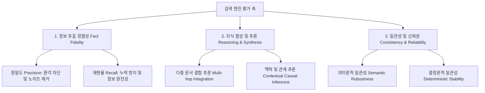

# 🧠 세컨드 브레인 검색 엔진 벤치마크 구현 계획 (Second Brain Search Engine Benchmark)

이 문서는 사용자의 비정형 지식 뭉치(세컨드 브레인)에서 지식을 정확히 검색·추출하는 **세컨드 브레인 검색 엔진(Second Brain Search Engine)**의 성능을 측정하는 벤치마크 구축 계획입니다.

---

## 1. 용어 정의 (Conceptual Definitions)

역할과 대상에 대해 합의된 명확한 개념 정의는 다음과 같습니다.

1.  **세컨드 브레인 (Second Brain)**: 팀이나 개인이 지식을 저장하는 위키(Wiki), 마크다운(Markdown) 폴더와 같은 비정형 지식 뭉치. (벤치마크의 **입력 데이터**)
2.  **세컨드 브레인 검색 엔진 (Second Brain Search Engine)**: 세컨드 브레인에서 에이전트나 사람이 지식을 정확하고 효율적으로 추출할 수 있도록 돕는 엔진. (벤치마크의 **평가 대상**)
3.  **세컨드 브레인 검색 엔진 벤치마크 (Second Brain Search Engine Benchmark)**: 검색 엔진이 세컨드 브레인의 정보를 얼마나 왜곡 없이, 누락 없이, 잘 추론하여 제공하는지 검증하는 도구. (우리가 **개발하는 산출물**)

---

## 2. 평가 환경 및 구동 모델 (Evaluation Environment)

*   **실행 주체**: 사람이 AI 에이전트(Claude, Antigravity, Codex 등)를 통해 벤치마크를 수행한다고 가정합니다.
*   **에이전트 친화적 설계**: 
    *   평가 스크립트 실행 후 즉시 마크다운 형태의 최종 보고서가 생성되어 에이전트가 이를 파싱하고 사람에게 설명하기 쉽게 만듭니다.
    *   평가 질문 세트는 JSON 포맷으로 작성되어 프로그램이 쉽게 읽고 쓸 수 있도록 합니다.

---

## 3. 평가 축 재구성 (Evaluation Axes)

세컨드 브레인 검색 엔진이 갖추어야 할 핵심 성능을 측정하기 위해 **3대 영역, 6개 세부 지표**로 평가 축을 정의합니다.

### 1) 정보 추출 정합성 (Fact Fidelity)
*   **정밀도 (Precision - 환각 차단)**
    *   **평가 내용**: 세컨드 브레인에 없는 거짓 내용(환각)을 지어내거나 과도하게 왜곡하여 답변하는지 검증.
*   **재현율 (Recall - 누락 방지)**
    *   **평가 내용**: 질문에 답하기 위해 필수적인 핵심 사실(Key Facts)을 누락하지 않고 온전히 찾아내어 답변하는지 검증.

### 2) 지식 합성 및 추론 (Reasoning & Synthesis)
*   **다중 문서 결합 추론 (Multi-hop Integration)**
    *   **평가 내용**: 하나의 문서가 아니라 여러 개별 메모에 흩어진 정보들을 종합하여 연관 관계나 논리를 연결하는 능력 검증.
*   **맥락 및 관계 추론 (Contextual Causal Inference)**
    *   **평가 내용**: 텍스트에 명시적으로 나타나지 않더라도 전체적인 타임라인, 인물의 동기, 사건의 선후관계를 바탕으로 논리적으로 인과관계를 추론하는 능력 검증.

### 3) 일관성 및 신뢰성 (Consistency & Reliability)
*   **의미론적 일관성 (Semantic Robustness)**
    *   **평가 내용**: 질문의 형태나 표현(Paraphrasing)이 달라지더라도 일관되게 정확한 핵심 지식을 찾아내어 답변하는지 검증.
*   **결정론적 일관성 (Deterministic Stability)**
    *   **평가 내용**: 동일한 질문을 여러 번 입력했을 때, 지식 추출의 완성도나 결과가 균일하게 유지되는지 검증.

---

## 4. 벤치마크 구성 요소 및 구현 순서

1.  **세컨드 브레인 샘플 데이터셋 (`second_brain/` 폴더)**:
    *   기업 내부 횡령 미스터리를 다루는 마크다운 파일들의 집합.
    *   다양한 인물 관계, 일지, 연대표, 재무 기록 등으로 구성되어 다중 문서 추론을 강제하도록 설계.
2.  **평가 질문지 (`questions.json`)**:
    *   각 평가 축에 맞춰 채점 기준(루브릭)과 모범 답안(Ground Truth)이 포함된 JSON 파일.
3.  **평가 스크립트 (`evaluator.py`)**:
    *   검색 엔진의 답변을 수집하여 채점하고, 최종 보고서(`benchmark_report.md`)를 작성해 주는 도구.

---
> [!NOTE]
> 개념 정리가 완벽하게 일치합니다! 
> 합의된 개념에 기반하여 먼저 **세컨드 브레인 샘플 데이터셋(횡령 미스터리 테마)**과 **평가 질문지**를 생성하겠습니다.
